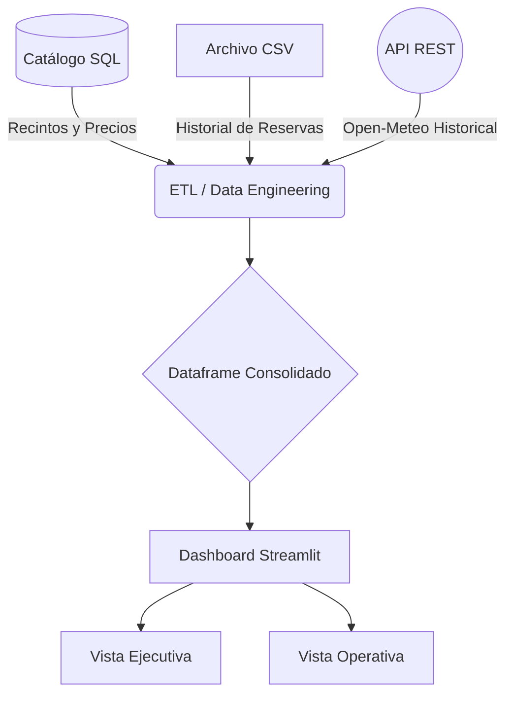

# SearchSport Analytics - Pipeline End-to-End


Este proyecto consiste en una solución de datos integral (end-to-end) para **SearchSport**, una plataforma de arriendo de recintos deportivos. 
El sistema extrae, transforma y cruza datos transaccionales con información climática externa para identificar fugas de capital asociadas a cancelaciones por condiciones meteorológicas.


## Arquitectura del Sistema

El pipeline de datos procesa y unifica tres fuentes heterogéneas mediante scripts en Python, automatizando la ingesta y disponibilizando la información a través de un dashboard analítico.



El repositorio sigue una arquitectura modular orientada a las buenas prácticas de ciencia de datos y DevOps:
```
/searchsport-analytics
├── /api/               # Scripts y configuraciones para el consumo de la API REST
├── /dashboards/        # Lógica de visualización y frontend (dashboard.py)
├── /data/              # Datos originales (CSV) y procesados
├── /docker/            # Archivos de containerización (Dockerfile, docker-compose)
├── /docs/              # Documentación técnica, manuales y diagramas
├── /etl/               # Scripts del pipeline de extracción y transformación
├── /repo/              # Evidencias de trabajo colaborativo en Git
└── /tests/             # Scripts de validación de esquemas y testing
```

Documentación de la API (Terceros)
Para enriquecer el modelo y comprobar las hipótesis de negocio, se integra información meteorológica histórica utilizando la siguiente API pública:

Proveedor: Open-Meteo Historical Weather API

Base URL: https://archive-api.open-meteo.com/v1/archive

Parámetros de Ingesta:

latitude: -33.4569 (Región Metropolitana, Santiago)

longitude: -70.6483

daily: precipitation_sum (Utilizado para clasificar la variable booleana de "Lluvia/Frio").

Manejo de Errores: El pipeline ETL cuenta con validación de respuestas HTTP y lógicas try-except para garantizar la continuidad del flujo analítico en caso de latencias o caídas del servidor origen.

Guía de Instalación y Despliegue (Docker)El proyecto está en conteiners docker para asegurar la reproducibilidad en cualquier entorno.  

Requisitos Previos:

Git instalado.

Docker y Docker Compose instalados y en ejecución.

Pasos para DesplegarClonar el repositorio:
```bash
clone [https://github.com/CristobalSilvam/analisis-searchsport-.git](https://github.com/CristobalSilvam/analisis-searchsport-.git)
```
Generar el dataset base (ETL):
```bash
python etl/generar_datos_searchsport.py
```
(Nota: El script utiliza semillas fijas seed(82) para garantizar la reproducibilidad exacta de los datos sintéticos).
Construir y levantar la orquestación:
```bash
docker-compose up --build
```
Acceder a la aplicación:

Abre tu navegador web e ingresa a http://localhost:8501.

Para detener el servicio de forma limpia, ejecuta docker-compose down en tu terminal.

Sin docker: 
instalamos las herramientas necesarias y luego ejecutamos el dashboard.
```console
py -m pip install pandas faker streamlit plotly.express 
streamlit run dashboard.py 
```
Manual de Usuario
La plataforma analítica está diseñada en base a dos perfiles de usuario, accesible a través de pestañas de navegación:

Panel de Filtros (Sidebar): Permite segmentar transversalmente el dashboard por Comuna, Deporte y Condición Climática. La interfaz es reactiva y actualiza las métricas en tiempo real.

Vista Ejecutiva (Directorio): Orientada a métricas de negocio de alto nivel. Presenta KPIs de rentabilidad, fugas de capital y el impacto monetario consolidado por las inclemencias climáticas.

Vista Operativa (Administradores): Diseñada para la identificación de cuellos de botella geográficos. Incluye matrices de demanda peak (horarios) y un ranking horizontal interactivo de las comunas con mayores tasas de cancelación, permitiendo una rápida focalización de recursos territoriales.

Equipo de Desarrollo:

Cristóbal Silva

Alfonso Sutherland

Diego Echeverria
